# Paktikum4_SQL_Query_Filter


## **Tugas Praktikum**

- **MEMBUAT DATABASE & TABEL PEGAWAI**<br>
1. Buat create tabel databases terlebih dahulu, disini saya membuat database dengan nama latihan4 seperti yang terlihat di gambar<br>
2. Lalu create table pegawai dengan mengisi (id_pegawai, nama_depan, nama_belakang,email, tlp, tgl_kontrak, id_job, gaji, dan tunjangan) seperti yang terlihat di gambar<br>
3. Lalu masukan dengan cara insret into pegawai seperti yang terlihat pada gambar untuk melihat hasil tabelnya kita select * from pegawai seperti yang terlihat pada gambar <br>
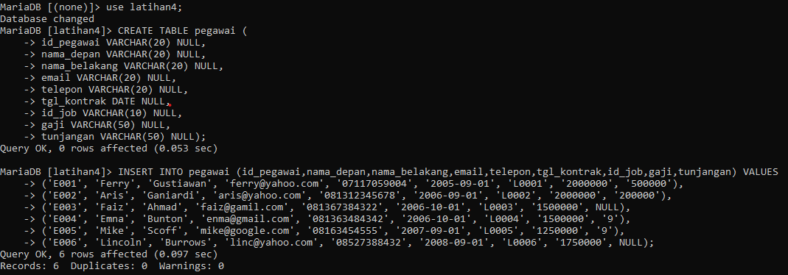<br>
    
- **TABEL pegawai**
  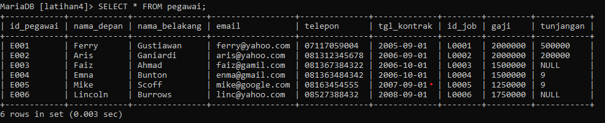<br>
1. Tampilkan pegawai yang gajinya bukan 2.000.000 dan 1.250.000!
  - Perintah
    ```sql
    SELECT * FROM pegawai WHERE gaji <> 2000000 AND gaji <> 1250000;
    ```
  - Output<br>
    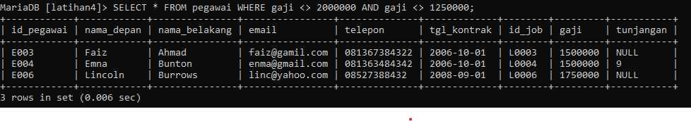<br>
2. Tampilkan pegawai yang tunjangannya NULL!
  - Perintah
    ```sql
    SELECT * FROM pegawai WHERE tunjangan IS NULL;
    ```
  - Output<br>
    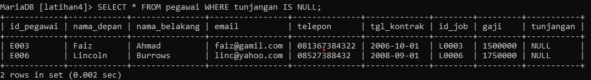<br>
3. Tampilkan pegawai yang tunjangannya tidak NULL!
  - Perintah
    ```sql
    SELECT * FROM pegawai WHERE tunjangan IS NOT NULL;
    ```
  - Output<br>
    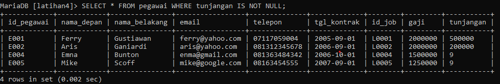<br>
4. Tampilkan/hitung jumlah baris/record tabel pegawai!
  - Perintah
    ```sql
    SELECT COUNT(*) AS jumlah_baris FROM pegawai;
    ```
  - Output<br>
    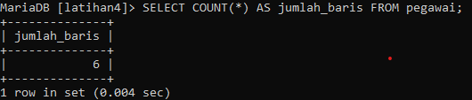<br>
5. Tampilkan/hitung jumlah total gaji di tabel pegawai!
  - Perintah
    ```sql
    SELECT SUM(gaji) AS total_gaji FROM pegawai;
    ```
  - Output<br>
    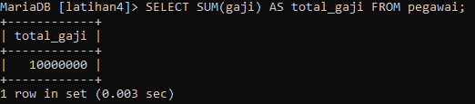<br>
6. Tampilkan/hitung jumlah rata-rata gaji pegawai!
  - Perintah
    ```sql
    SELECT AVG(gaji) AS rata_gaji FROM pegawai
    ```
  - Output<br>
    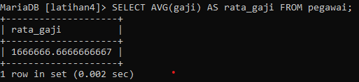<br>
7. Tampilkan gaji terkecil!
  - Perintah
    ```sql
    SELECT MIN(gaji) AS gaji_terkecil FROM pegawai;
    ```
  - Output<br>
    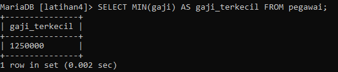<br>
8. Tampilkan gaji terbesar!
  - Perintah
    ```sql
    SELECT MAX(gaji) AS gaji_terbesar FROM pegawai;
    ```
  - Output<br>
    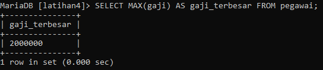<br>


- **TABEL hewan**
  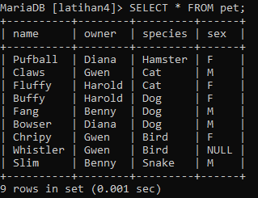<br>
1. Tampilkan jumlah hewan yang dimiliki setiap owner!
  - Perintah
    ```sql
    SELECT owner, COUNT(*) AS jumlah_hewan FROM pet GROUP BY owner;
    ```
  - Output<br>
    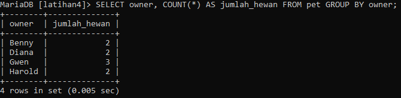<br>
2. Tampilkan jumlah hewan berdasarkan spesies!
  - Perintah
    ```sql
    SELECT species, COUNT(*) AS jumlah_hewan FROM pet GROUP BY species;
    ```
  - Output<br>
    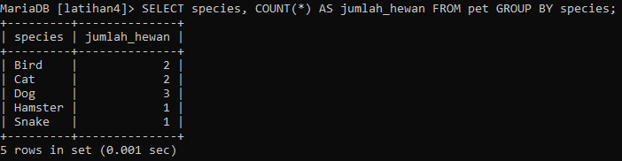<br>
3. Tampilkan jumlah hewan berdasarkan jenis kelamin!
  - Perintah
    ```sql
    SELECT sex, COUNT(*) AS jumlah_hewan FROM pet GROUP BY sex;
    ```
  - Output<br>
    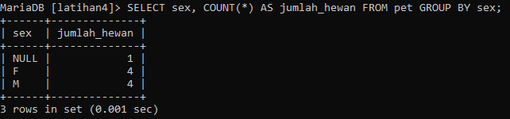<br>
4. Tampilkan jumlah hewan berdasarkan spesies dan jenis kelamin!
  - Perintah
    ```sql
    SELECT species,sex, COUNT(*) AS jumlah_hewan FROM pet
    GROUP BY species,sex;
    ```
  - Output<br>
    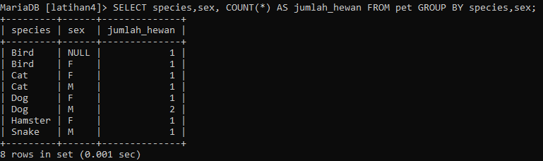<br>
5. Tampilkan jumlah hewan berdasarkan spesies (cat dan dog saja) dan jenis kelamin!
  - Perintah
    ```sql
    SELECT species,sex, COUNT(*) AS jumlah_hewan FROM pet
    WHERE species IN('Cat','Dog')
    GROUP BY species,sex;
    ```
  - Output<br>
    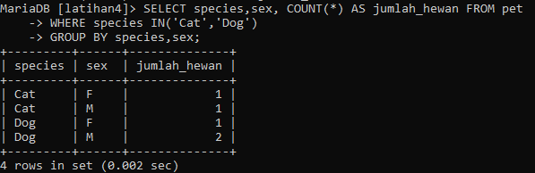<br>
6. Tampilkan jumlah hewan berdasarkan jenis kelamin yang diketahui saja!
  - Perintah
    ```sql
    SELECT sex, COUNT(*) AS jumlah_hewan FROM pet
    WHERE sex IN('f','m')
    GROUP BY sex;
    ```
  - Output<br>
    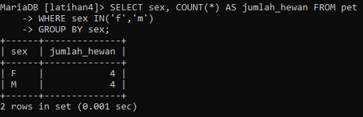<br>

### **Kesimpulan**

1. Filter query digunakan untuk memfilter data yang diambil dari tabel berdasarkan kondisi tertentu.
2. Kondisi dalam query filter dapat menggunakan operator perbandingan seperti `=`, `<>`, `<`, `>`, `<=`, `>=`, dan operator logika seperti `AND`, `OR`, `NOT`.
3. Kondisi dalam query filter dapat diterapkan pada satu kolom atau kombinasi dari beberapa kolom.
4. Query filter menggunakan klausa `WHERE` untuk menentukan kondisi yang akan digunakan.
5. Query filter juga dapat menggunakan klausa `LIKE` untuk mencari data yang cocok dengan pola tertentu menggunakan wildcard seperti `%` atau `_`.
6. Query filter juga mendukung penggunaan klausa `IN` untuk menetapkan nilai dengan kumpulan nilai yang ditentukan.
7. Anda juga dapat menggunakan klausa `ORDER BY` untuk mengurutkan hasil query berdasarkan kolom tertentu secara naik (ASC) atau turun (DESC).
8. Jika ingin membatasi jumlah data yang diambil, Anda dapat menggunakan klausa `LIMIT`.
9. Filter query dapat digunakan dalam kombinasi dengan klausa-klausa lain seperti `JOIN` dan `GROUP BY` untuk menghasilkan hasil query yang lebih kompleks.